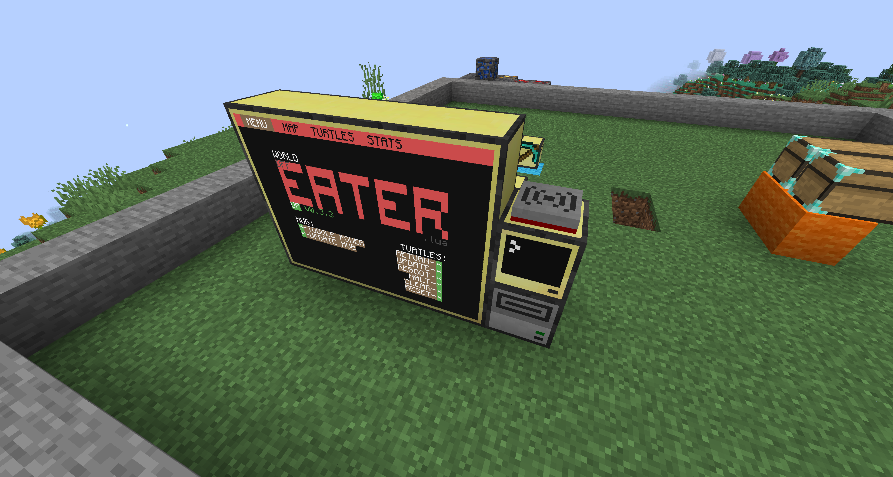
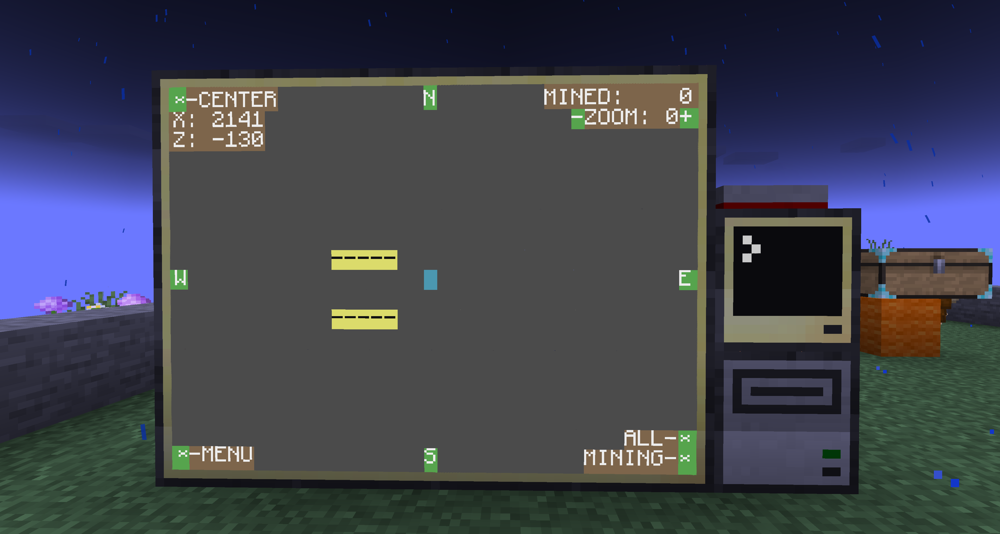
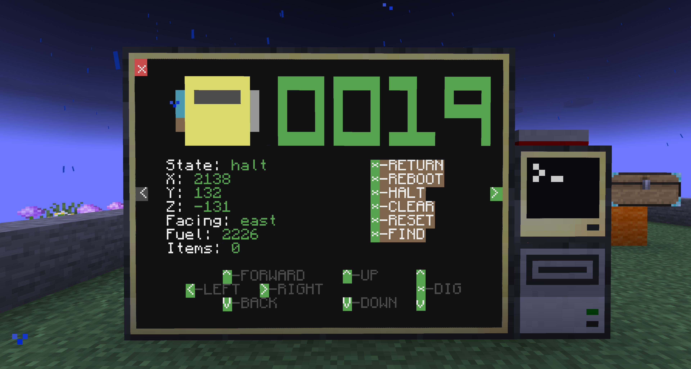
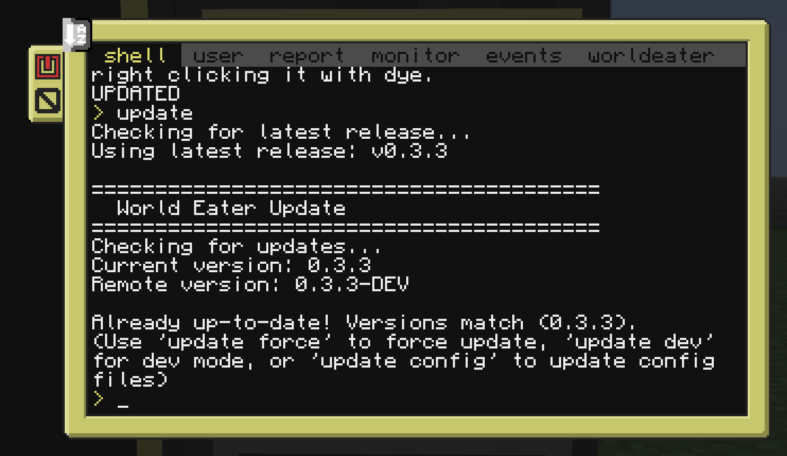

# CC-World-Eater

[](https://github.com/Jemsire/CC-World-Eater/releases)
[](LICENSE)
[](https://github.com/Jemsire/CC-World-Eater/stargazers)
[](https://github.com/Jemsire/CC-World-Eater/network/members)
[](https://github.com/Jemsire/CC-World-Eater/issues)
[](https://discord.jemsire.com/)

A fully automated world-eating mining system for ComputerCraft turtles! Mines entire areas from surface to bedrock using coordinated multi-turtle operations. Each turtle is assigned a column (x, z coordinate) and mines vertically from the surface down to bedrock, ensuring complete excavation of the mining area.

# NOT IN FUNCTIONAL STATE - BREAKING CHANGES CONSTANT - WAIT FOR 1.0.0 TO USE!
```^^^^^^^^^^^^^^^^^^^^^^^^^^^^^^^^^^^^^^^^```

## 🚀 Quick Start

### Prep Area (Setup)

```
8 blocks each direction from center block(Stone border shown is 19x19)
Left and right should be left clear when setting up turtles
Computer can be built anywhere south or north of the main center block
From center block mine down a block and 1 block south of the center block
Prep at least 1 pair if using chunk turtles or 1 miner if not
Top chest is a fuel chest
Lower chest is the dump chest so make sure it has lots of space or a storage system attached.
```

### Main Computer (Setup)

```
Drive MUST be one block below computer
Wireless modem should be on top to save space.
Monitors are 4 long by 3 tall (4x3)
```

### Installation via GitHub(Recommended Method)

1. Build the setup
2. Open the main hub computer
3. Download the installer by running: `wget https://raw.githubusercontent.com/Jemsire/CC-World-Eater/main/install.lua install.lua`
4. Type `install.lua` and hit enter to run (installs latest stable release by default)
5. Follow the installation prompts to set up your World Eater system

**Note:** The installer automatically checks for the latest release version and installs that version. This ensures you get a stable, tested release.

### Installation via Pastebin

1. Build the setup
2. Open the main hub computer
3. Upload the install.lua as a [pastebin](https://pastebin.com/) and copy your code/ID(recommend 10 minute deletion time)
3. Run `pastebin get <PASTEBIN_ID> install.lua`
4. Type `install.lua` and hit enter to run (installs latest stable release by default)
5. Follow the installation prompts to set up your World Eater system

### Dev Mode Installation (⚠️ Unsupported)

**⚠️ WARNING: Dev mode installs are UNSUPPORTED and may have breaking changes!**

If you want to install the latest commits from the main branch (dev mode) instead of the latest stable release:

```bash
install.lua dev
```

**Important Notes:**
- Dev mode installs the latest commits from the `main` branch, which may include untested or incomplete features
- **No support will be provided for dev installs** - use at your own risk
- Dev installs may have breaking changes that require manual fixes
- Configuration files may be incompatible between dev versions
- Always backup your configuration before installing dev updates
- If you encounter issues with a dev install, you must revert to a stable release to receive support

**When to use dev mode:**
- You are a developer contributing to the project
- You want to test the latest features before they are released
- You understand the risks and are comfortable troubleshooting issues yourself

**When NOT to use dev mode:**
- You want a stable, production-ready installation
- You need support for issues
- You are not comfortable troubleshooting breaking changes


## 📋 Features

- **Vertical Column Mining**: Each turtle is assigned a column (x, z coordinate) and mines straight down from surface to bedrock, ensuring thorough excavation
- **Multi-Turtle Coordination**: Automatically manages multiple turtles working together in parallel, with each turtle handling its assigned column
- **Surface to Bedrock Mining**: Excavates entire areas from top to bottom (automatically stops when turtles encounter bedrock or other protected blocks)
- **GPS-Based Navigation**: Uses ComputerCraft GPS for precise positioning and auto-detection of hub location
- **Mining Radius Control**: Configure mining area with radius limits or unlimited expansion
- **Obstacle Avoidance**: Turtles automatically navigate around protected blocks (chests, computers, spawners, etc.)
- **Auto-Detection**: Hub computer location and disk drive position are automatically detected via GPS
- **Flexible Configuration**: Works with or without peripheral mods (Chunky Turtles optional)
- **Real-Time Monitoring**: Hub computer provides status updates, turtle views, and control interface
- **GitHub Integration**: Direct updates from GitHub repository with automatic version tracking
- **Version Management**: Centralized version tracking for hub and turtles with alerts
- **Installation Wizard**: Interactive setup wizard guides you through configuration

## 🎮 Compatibility

### Required Mods

- **CC Tweaked** - [CurseForge](https://www.curseforge.com/minecraft/mc-mods/cc-tweaked)

### Optional Peripherals (Recommended)

**For Minecraft 1.16+**
- **Advanced Peripherals** - [CurseForge](https://www.curseforge.com/minecraft/mc-mods/advanced-peripherals)

**For Minecraft 1.12**
- **Peripherals Plus One** - [GitHub](https://github.com/rolandoislas/PeripheralsPlusOne)
- **The Framework** (Required by PeripheralsPlusOne) - [CurseForge](https://www.curseforge.com/minecraft/mc-mods/the-framework)

### Play with or without Peripherals

I highly recommend using a peripherals mod with chunky turtles, but upon popular request I added the ability to disable the need for chunky turtle pairs. Just go to the config and set `use_chunky_turtles = false`.

## ⚙️ Configuration

The World Eater system is highly configurable through `hub_files/config.lua`. Key settings include:

### Mining Area Configuration

- **`mining_radius`**: Set a circular mining radius (in blocks) from the mining center. Set to `nil` for unlimited mining.
  ```lua
  mining_radius = 100  -- Mines 100 blocks radius (200 block diameter)
  ```

- **`mine_entrance`**: Central reference point for the entire setup (center of prep area, y should be 1 block above surface)
  ```lua
  mine_entrance = {x = 2141, y = 132, z = -130}
  ```

- **`mission_length`**: Maximum number of blocks to mine per trip before returning to base (default: `150`)
  ```lua
  mission_length = 150
  ```

### Turtle Behavior

- **`use_chunky_turtles`**: Enable/disable chunky turtle pairs (default: `true`)
- **`fuel_padding`**: Extra fuel turtles bring along as safety margin (default: `30`)
- **`fuel_per_unit`**: Fuel value per fuel item (default: `80` for coal)

### Protected Blocks

Blocks containing these strings will not be mined (turtles navigate around them):
- `computer`, `chest`, `spawner`, `beacon`, `enchanting_table`, `command_block`, `bedrock`, etc.

Configure in `dig_disallow` table in `hub_files/config.lua`.


## 📺 Video Tutorials

### Description Video
**Coming Soon**

### Installation Tutorial
**Coming Soon**

## 📸 Screenshots


```Main mining screen to show whats complete and whats not.```


```View each turtle individually for debugging or controlling manually.```


```Auto updater that grabs from github for latest updates easily!```


```Settings menu allows you to mass send commands to turtles and turn it on or off.```

## 🎮 User Commands

Control your World Eater system with these commands:

### System Control
- `on` / `go` - Start the mining operation
- `off` / `stop` - Stop the mining operation

### Individual Turtle Control
- `turtle <#> <action>` - Control a specific turtle
- `reboot <#>` - Reboot a turtle
- `shutdown <#>` - Shutdown a turtle
- `reset <#>` - Reset a turtle's state
- `clear <#>` - Clear a turtle's inventory
- `halt <#>` - Halt a turtle's current operation
- `return <#>` - Return a turtle to base

**Note:** Turtles are updated automatically when the hub runs `update` - no individual turtle update command needed.

### Hub Control
- `update` - Update hub computer code and all turtles (when run without turtle ID)
- `reboot` - Reboot hub computer (when run without turtle ID)
- `shutdown` - Shutdown hub computer (when run without turtle ID)

> **Tip:** Use `*` as notation for all turtles (e.g., `reboot *` reboots all turtles)

## 🔄 Updating from GitHub

All systems can be updated directly from the GitHub repository. Updates automatically preserve your configuration files.

### Hub Computer Update (Updates Hub + All Turtles)

From the hub computer, simply type:
```
update
```

This will update both the hub computer and all connected turtles automatically to the latest stable release. The update system will:
1. Queue all turtles for update
2. Send each turtle home (if not already there)
3. Have turtles navigate to the disk drive one at a time
4. Update each turtle sequentially (prevents conflicts)
5. Update the hub computer after all turtles complete

**Note:** Turtles must be able to navigate back to the hub area for updates. If a turtle is too far away or stuck, you may need to manually return it first using the `return <#>` command.

To update via the update script directly (hub only):
```lua
disk/hub_files/update
```

To also update config files (not recommended unless you want to reset your settings):
```lua
disk/hub_files/update force-config
```

### Dev Mode Updates (⚠️ Unsupported)

**⚠️ WARNING: Dev mode updates are UNSUPPORTED and may have breaking changes!**

To update to the latest commits from the main branch (dev mode) instead of the latest stable release:

```lua
disk/hub_files/update dev
```

**Important Notes:**
- Dev mode updates install the latest commits from the `main` branch, which may include untested or incomplete features
- **No support will be provided for dev updates** - use at your own risk
- Dev updates may have breaking changes that require manual fixes
- Configuration files may be incompatible between dev versions
- Always backup your configuration before updating to dev
- If you encounter issues with a dev update, you must revert to a stable release to receive support

**When to use dev mode:**
- You are a developer contributing to the project
- You want to test the latest features before they are released
- You understand the risks and are comfortable troubleshooting issues yourself

**When NOT to use dev mode:**
- You want a stable, production-ready system
- You need support for issues
- You are not comfortable troubleshooting breaking changes

### Turtle Update

Turtles can be updated using `update` in their terminals or using the menu to update one or all. They copy files directly from the hub's disk drive (no GitHub download needed). Turtles always update their config files to stay in sync with the hub's configuration.


**Note:** 
- Hub update: By default, config files (`config.lua` and `info.lua`) are **not** updated to preserve your settings. Use `update config` only if you want to reset to default configurations.
- Turtle update: Turtles **always** update their config files when updating to stay in sync with the hub's configuration.

## 💾 Storage & Installation

### Floppy Disk Size Limit

ComputerCraft has a default limit of 512KB per floppy disk. World Eater currently uses approximately 213KB total, which fits comfortably on a single disk with plenty of room for future growth (~299KB remaining).

If you need more space, you can increase the floppy disk size limit in the mod's config file.

### Installation Methods

The installer supports multiple methods:
- **GitHub Download** (Recommended): Direct download from repository
- **Pastebin Fallback**: For environments without internet access
- **Interactive Wizard**: Guides you through mine entrance setup and configuration

The installer automatically:
- Detects system type (hub/turtle/pocket/chunky)
- Downloads appropriate files
- Sets up file structure on disk drive
- Validates hub location via GPS

## 🔧 Troubleshooting

After having some chats with folks, it seems like there are some common pitfalls within the turtle setup. If you're getting weird behavior, check this list before posting an issue:

### Common Issues

* **GPS has an incorrect coordinate.** There are 4 computers in the GPS setup, each with an x, y, and z coordinate. If any of these numbers are entered wrong, the GPS will act funky and nothing will work. A good way to test it's working is to enter `gps locate` into any rednet enabled computer or turtle and verify the answer.

* **Mine entrance coordinates are incorrect.** The `mine_entrance` in the config file is the **center of the prepare area** (y should be 1 block above surface), not the hub computer location. The hub computer location is automatically detected via GPS at startup. The disk drive location is automatically calculated as 1 block below the hub computer. Make sure your GPS system is working correctly (`gps locate` should return valid coordinates).

* **Turtles are more than 8 blocks away from the mine entrance.** Turtles have to be within the `control_room_area` when they are above ground, otherwise they will get lost and end up in `halt` mode. The `control_room_area` field in the `hub_files/config.lua` file is adjustable to fit whatever size you need. **Note:** If you have a large number of turtles, you may need to increase the control room area to fit a larger turtle parking area.

* **Mining radius too large or unlimited.** If you set `mining_radius = nil` or a very large radius, the system will attempt to mine an enormous area. Consider setting a reasonable radius limit in `hub_files/config.lua`.

* **Protected blocks blocking progress.** If turtles keep getting stuck on the same blocks, those blocks may be in the `dig_disallow` list. Check `hub_files/config.lua` and remove any blocks you want mined (except bedrock, which should always be protected).

* **Version mismatch between hub and turtles.** The system uses a shared version file (`shared_files/version.lua`). Run `update` from the hub to ensure all systems are synchronized to the same version.

Hopefully that covers a lot of it. Again, let me know if you still can't get the thing to work.

## 📁 Project Structure

```
CC-World-Eater/
├── hub_files/          # Hub computer files
│   ├── config.lua      # Hub configuration (mining settings, locations, etc.)
│   ├── monitor.lua     # Status monitoring and UI
│   ├── worldeater.lua  # Mining assignment and block tracking
│   ├── github_api.lua  # GitHub API helper functions
│   ├── events.lua     # Event handling and turtle communication
│   ├── user.lua       # User input handling
│   ├── report.lua     # Status reporting
│   ├── state.lua      # State management
│   ├── startup.lua    # Hub startup script
│   └── ...
├── turtle_files/       # Turtle computer files
│   ├── config.lua      # Turtle configuration
│   ├── mastermine.lua # Main turtle logic and request processing
│   ├── actions.lua     # Mining actions (go_to_block, mine_to_bedrock, etc.)
│   ├── receive.lua    # Rednet message receiving
│   ├── report.lua     # Status reporting
│   ├── state.lua      # State management
│   ├── startup.lua    # Turtle startup script
│   └── ...
├── pocket_files/       # Pocket computer files
│   ├── info.lua       # Pocket computer info
│   ├── report.lua     # Status reporting
│   ├── startup.lua    # Pocket startup script
│   └── ...
├── shared_files/       # Shared files between hub and turtles
│   ├── version.lua     # Version tracking (currently v0.3.2)
│   └── basics.lua     # Basic utility functions
├── assets/             # Images and assets for documentation
│   └── images/         # Screenshots and setup images
├── hub.lua             # Hub bootstrap script
├── turtle.lua          # Turtle bootstrap script
└── pocket.lua          # Pocket bootstrap script
```

## 🤝 Contributing

Contributions are welcome! Please feel free to submit a Pull Request. For major changes, please open an issue first to discuss what you would like to change.

## 📝 License

This project is licensed under the MIT License - see the [LICENSE](LICENSE) file for details.

## 🙏 Acknowledgments

- [Mastermine](https://github.com/merlinlikethewizard/Mastermine) - The original script that this project was reworked from
- CC Tweaked for the amazing ComputerCraft implementation
- Advanced Peripherals / Peripherals Plus One for enhanced turtle capabilities
- All the community members who have tested and provided feedback

---

**Made for ComputerCraft / CC Tweaked**
